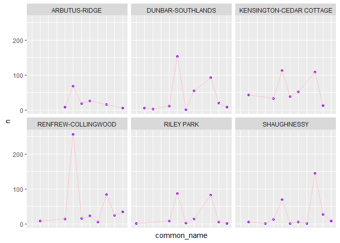
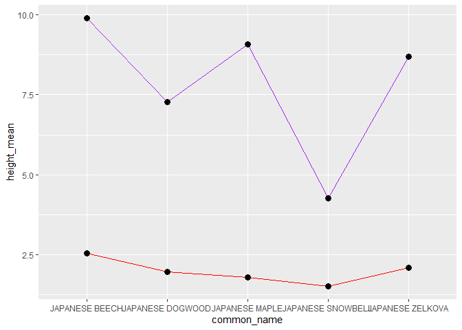
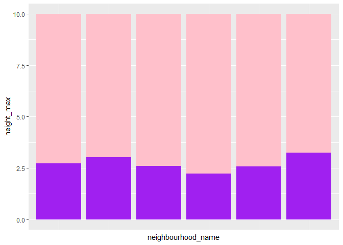
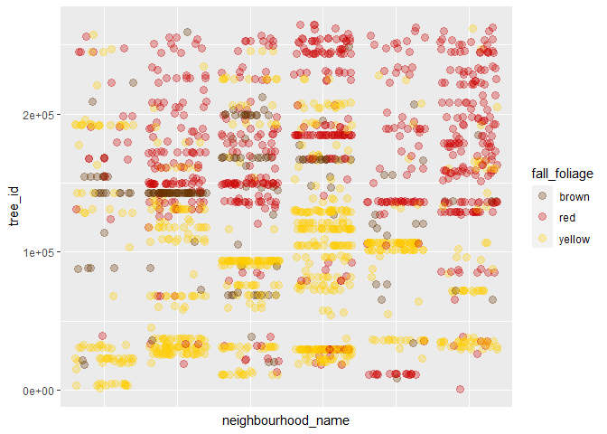

Mini Data Analysis Milestone 2
================

# Welcome back to my mini data analysis project!

This time, we will explore more in depth the concept of *tidy data*, and
investigate further into my research questions that was defined in
milestone 1. We will be using the dataset “vancouver_trees” to
investigate patterns of Japanese originated tree species spreading
across the area of Vancouver. Let’s get started!

Begin by loading data, and the packages datateachr, tidyverse, ggplot2
as follows:

``` r
suppressPackageStartupMessages(library(datateachr)) # <- might contain the data you picked!
suppressPackageStartupMessages(library(tidyverse))
suppressPackageStartupMessages(library(ggplot2))
```

# Task 1: Process and summarize your data (15 points)

From milestone 1, we have an idea of the basic structure of my dataset
(e.g. number of rows and columns, class types,a lot of NA values, etc.).
Here, we will start investigating your data more in-depth using various
data manipulation functions.

### 1.1 (2.5 points)

First, write out the 4 research questions you defined in milestone 1
were. This will guide our work through milestone 2:

<!-------------------------- Student work below ---------------------------->

1.  For all trees that have common names starting with “Japanese”, how
    are they spread across the city of Vancouver? Do they gather in
    groups by different species? Were they only planted in a small
    subarea of Vancouver?
2.  For these “Japanese” trees of different species, how are their size
    related to their species? Which species have a tall and slim figure,
    and which have a short and round shape?
3.  How are trees of different heights spread across different areas
    within Vancouver? Do they follow any patterns (e.g. similar height
    on the same street)?
4.  If investigating times of falling leaves for different tree species,
    how will it affect each areas of Vancouver with different color of
    trees, amount of tree shadow, etc?
    <!----------------------------------------------------------------------------->

### 1.2 (10 points)

Now, for each of my four research questions, I will choose one task from
options 1-4 (summarizing), and one other task from 4-8 (graphing).

**Summarizing:**

1.  Compute the *range*, *mean*, and *two other summary statistics* of
    **one numerical variable** across the groups of **one categorical
    variable** from your data.
2.  Compute the number of observations for at least one of your
    categorical variables. Do not use the function `table()`!
3.  Create a categorical variable with 3 or more groups from an existing
    numerical variable. You can use this new variable in the other
    tasks! *An example: age in years into “child, teen, adult, senior”.*
4.  Based on two categorical variables, calculate two summary statistics
    of your choosing.

**Graphing:**

5.  Create a graph out of summarized variables that has at least two
    geom layers.
6.  Create a graph of your choosing, make one of the axes logarithmic,
    and format the axes labels so that they are “pretty” or easier to
    read.
7.  Make a graph where it makes sense to customize the alpha
    transparency.
8.  Create 3 histograms out of summarized variables, with each histogram
    having different sized bins. Pick the “best” one and explain why it
    is the best.

Before we dive into our research questions, let’s update our dataset to
the refined one from last milestone - we use this new dataset with
unnecessary variables and extreme values taken out and keep only the
trees of Japanese origin.

``` r
# Look at all common_name present in the dataset
unique(select(vancouver_trees, common_name))
```

    ## # A tibble: 634 x 1
    ##    common_name          
    ##    <chr>                
    ##  1 BRANDON ELM          
    ##  2 JAPANESE ZELKOVA     
    ##  3 JAPANESE SNOWBELL    
    ##  4 AUTUMN APPLAUSE ASH  
    ##  5 HEDGE MAPLE          
    ##  6 CHANTICLEER PEAR     
    ##  7 COLUMNAR NORWAY MAPLE
    ##  8 CRIMEAN LINDEN       
    ##  9 ROSE OF SHARON       
    ## 10 RAYWOOD ASH          
    ## # ... with 624 more rows

``` r
# Select only those starting with Japanese and put into a variable of common_name
selected_common_name = c("JAPANESE SNOWBELL", "JAPANESE DOGWOOD", "JAPANESE ZELKOVA", "JAPANESE BEECH", "JAPANESE MAPLE", "JAPANESE FLOWERING CRABAPPLE", "JAPANESE STEWARTIA", "JAPANESE STEWARTIA", "JAPANESE HORNBEAM", "JAPANESE PAGODA TREE", "JAPANESE CRYPTOMERIA", "JAPANESE WALNUT", "JAPANESE ANGELICA TREE", "JAPANESE WHITE PINE", "JAPANESE BLACK PINE", "JAPANESE CHESTNUT")
# Create a new tibble containing only Japanese originated trees and take out some irrelevant variables and extreme values
Japanese_trees <- vancouver_trees %>%
  select(-civic_number, -assigned, -cultivar_name, -street_side_name, -longitude, -latitude) %>%
  #filter(size < 7.5*10^3, diameter < 40) %>%
  filter(common_name %in% selected_common_name)
print(Japanese_trees)
```

    ## # A tibble: 4,613 x 14
    ##    tree_id std_street       genus_name species_name common_name     root_barrier
    ##      <dbl> <chr>            <chr>      <chr>        <chr>           <chr>       
    ##  1  149563 W 58TH AV        ZELKOVA    SERRATA      JAPANESE ZELKO~ N           
    ##  2  149579 WINDSOR ST       STYRAX     JAPONICA     JAPANESE SNOWB~ N           
    ##  3  149647 E 16TH AV        STYRAX     JAPONICA     JAPANESE SNOWB~ N           
    ##  4  149658 WINDSOR ST       STYRAX     JAPONICA     JAPANESE SNOWB~ N           
    ##  5  155398 MCRAE AV         STYRAX     JAPONICA     JAPANESE SNOWB~ N           
    ##  6  155424 W 57TH AV        CORNUS     KOUSA        JAPANESE DOGWO~ N           
    ##  7  155489 COMMERCIAL ST    FAGUS      CRENATA      JAPANESE BEECH  N           
    ##  8  155951 W KING EDWARD AV STYRAX     JAPONICA     JAPANESE SNOWB~ N           
    ##  9  156066 W 38TH AV        ACER       PALMATUM     JAPANESE MAPLE  N           
    ## 10  156067 W 38TH AV        ACER       PALMATUM     JAPANESE MAPLE  N           
    ## # ... with 4,603 more rows, and 8 more variables: plant_area <chr>,
    ## #   on_street_block <dbl>, on_street <chr>, neighbourhood_name <chr>,
    ## #   height_range_id <dbl>, diameter <dbl>, curb <chr>, date_planted <date>

#### Research Question 1:

*For all trees that have common names starting with “Japanese”, how are
they spread across the city of Vancouver? Do they gather in groups by
different species? Were they only planted in a small subarea of
Vancouver?*

**Summarizing task 2 - Count number of observations for categorical
variables**

We will look at different species of the Japanese trees and how each
species are distributed among different neighborhoods in the city of
Vancouver. We apply the summarise() function to sort all Japanese trees
into groups of neighborhood names and their species, and count the
number of trees per species inside each neighborhood.

``` r
answer1.1 <- Japanese_trees %>%
  group_by(neighbourhood_name, common_name) %>%
  summarise(n = n())
```

    ## `summarise()` has grouped output by 'neighbourhood_name'. You can override using the `.groups` argument.

``` r
print(answer1.1)  
```

    ## # A tibble: 165 x 3
    ## # Groups:   neighbourhood_name [22]
    ##    neighbourhood_name common_name                      n
    ##    <chr>              <chr>                        <int>
    ##  1 ARBUTUS-RIDGE      JAPANESE DOGWOOD                 8
    ##  2 ARBUTUS-RIDGE      JAPANESE FLOWERING CRABAPPLE    68
    ##  3 ARBUTUS-RIDGE      JAPANESE HORNBEAM               18
    ##  4 ARBUTUS-RIDGE      JAPANESE MAPLE                  26
    ##  5 ARBUTUS-RIDGE      JAPANESE SNOWBELL               16
    ##  6 ARBUTUS-RIDGE      JAPANESE ZELKOVA                 5
    ##  7 DOWNTOWN           JAPANESE DOGWOOD                 7
    ##  8 DOWNTOWN           JAPANESE FLOWERING CRABAPPLE     4
    ##  9 DOWNTOWN           JAPANESE HORNBEAM               19
    ## 10 DOWNTOWN           JAPANESE MAPLE                   1
    ## # ... with 155 more rows

From the tibble above, we observe very spread-out number of trees for
different species, for example, we have 68 “JAPANESE FLOWERING
CRABAPPLE” in the neighborhood ARBUTUS-RIDGE, whereas the other species
are around 20 in this neighborhood. Thus helps us understand the
distribution of tree species from research question 1.

**Graphing task 5 - Graph with two geom layers**

Continuing with the summarised tibble from above, we will focus on the
spread of trees of different species on the specific street “Dunbar
Southlands” which stretches from west to east of Vancouver. In total
there are 7 neighborhoods along the street, and we will plot the
distribution of number of trees among different species, for each
neighborhood on the street.

``` r
answer1.1 %>%
filter(neighbourhood_name %in% c("DUNBAR-SOUTHLANDS", "ARBUTUS-RIDGE", "SHAUGHNESSY", "RILEY PARK",  "KENSINGTON-CEDAR COTTAGE", "RENFREW-COLLINGWOOD") ) %>%
  ggplot(aes(x = common_name, y = n)) + geom_point(color = "purple") + geom_line(color = "pink", group = 1) + facet_wrap("neighbourhood_name") + theme(axis.text.x=element_blank(), axis.ticks.x=element_blank())
```

<!-- -->

From the line plot, we can conclude that there are two species that are
extremely common in all of the neighborhood on “Dunbar Southlands”.
Specifically, there are two significant spikes on every line plot that
are of the exact same x value, meaning these two species have large
counts for all the facets. This helps us gain better understanding of
the tree species distribution by explicitly presenting their counts
comparing to other species.

#### Research Question 2:

*For these “Japanese” trees of different species, how are their size
related to their species? Which species have a tall and slim figure, and
which have a short and round shape?*

**Summarizing task 3 - Make new categorical variable**

We will make a set of new variables: “height_level” and “diameter_level”
to classify these two parameters into categories. We will have heights
as “tall”, “medium” or “short” and diameters as “thick”, “medium” and
“slim”.

``` r
print(range(select(Japanese_trees, height_range_id)))
```

    ## [1] 0 7

``` r
print(range(select(Japanese_trees, diameter)))
```

    ## [1]   0 435

``` r
Japanese_trees %>%
  mutate(height_level = case_when(height_range_id < 3 ~ "short",
                                 height_range_id < 6 ~ "medium",
                                 TRUE ~ "tall")) %>%
  mutate(diameter_level = case_when(diameter < 10 ~ "slim",
                                 diameter < 30 ~ "medium",
                                 TRUE ~ "thick"))
```

    ## # A tibble: 4,613 x 16
    ##    tree_id std_street       genus_name species_name common_name     root_barrier
    ##      <dbl> <chr>            <chr>      <chr>        <chr>           <chr>       
    ##  1  149563 W 58TH AV        ZELKOVA    SERRATA      JAPANESE ZELKO~ N           
    ##  2  149579 WINDSOR ST       STYRAX     JAPONICA     JAPANESE SNOWB~ N           
    ##  3  149647 E 16TH AV        STYRAX     JAPONICA     JAPANESE SNOWB~ N           
    ##  4  149658 WINDSOR ST       STYRAX     JAPONICA     JAPANESE SNOWB~ N           
    ##  5  155398 MCRAE AV         STYRAX     JAPONICA     JAPANESE SNOWB~ N           
    ##  6  155424 W 57TH AV        CORNUS     KOUSA        JAPANESE DOGWO~ N           
    ##  7  155489 COMMERCIAL ST    FAGUS      CRENATA      JAPANESE BEECH  N           
    ##  8  155951 W KING EDWARD AV STYRAX     JAPONICA     JAPANESE SNOWB~ N           
    ##  9  156066 W 38TH AV        ACER       PALMATUM     JAPANESE MAPLE  N           
    ## 10  156067 W 38TH AV        ACER       PALMATUM     JAPANESE MAPLE  N           
    ## # ... with 4,603 more rows, and 10 more variables: plant_area <chr>,
    ## #   on_street_block <dbl>, on_street <chr>, neighbourhood_name <chr>,
    ## #   height_range_id <dbl>, diameter <dbl>, curb <chr>, date_planted <date>,
    ## #   height_level <chr>, diameter_level <chr>

From the tibble above, we have a better understanding of the
distribution of height and diameter of different Japanese tree species
and thus helps us comprehend research question 2. We can just look at
the new variables “height_level” and “diameter_level”, and make the
observation that most trees are in the medium category, for both height
and diameter; and we can continue working with these new variables and
explore the relationship between species and height, weight levels!

**Graphing task 5 - Graph with two geom layers**

We are going to explore the distribution of trees height and diameter
across each species. In other words, we observing which species have
larger heights and/or diameters, and which have smaller heights and/or
diameters. A line plot will be used to demonstrate the distribution. We
also filtered out species to only include five species that sound
pretty!

``` r
Japanese_trees %>%
  filter(common_name %in% c("JAPANESE SNOWBELL", "JAPANESE DOGWOOD", "JAPANESE ZELKOVA", "JAPANESE BEECH","JAPANESE MAPLE")) %>%
  group_by(common_name) %>%
  summarise(height_mean = mean(height_range_id, na.rm = TRUE), diameter_mean = mean(diameter, na.rm = TRUE)) %>%
  ggplot(aes(x = common_name)) + geom_line(aes(y = height_mean), group = 1, color = "red") + geom_line(aes(y = diameter_mean), group = 1, color = "purple") + geom_point(aes(y = height_mean), color = "black", size = 3) + geom_point(aes(y = diameter_mean), color = "black", size = 3)
```

<!-- -->

From the line plots above, we can observe the height-diameter
relationship for the five tree species that we chose. For example:
JAPANESE ZELKOVA and JAPANESE BEECH both have large heights and
diameters (i.e. tall and thick), and JAPANESE SNOWBELL has both small
heights and diameters (i.e. short and slim). These comparison between
the height plot and diameter plot helps us easily identify the
relationship we want from research question 2.

#### Research Question 3:

*How are trees of different heights spread across different areas within
Vancouver? Do they follow any patterns (e.g. similar height on the same
street)?*

**Summarizing task 1 - Compute summary statistics of one numerical
variable across one categorical variable**

We will look at different categories of “neighbourhood_name” of the
trees and explore their height statistics (e.g. mean, range, standard
deviation, count of trees per neighborhood):

``` r
answer3.1 <- Japanese_trees %>%
  group_by(neighbourhood_name) %>%
  summarise(height_mean = mean(height_range_id, na.rm = TRUE), height_min = min(height_range_id, na.rm = TRUE), height_max = max(height_range_id, na.rm = TRUE), height_std = sd(height_range_id, na.rm = TRUE), count = n())
  
print(answer3.1)
```

    ## # A tibble: 22 x 6
    ##    neighbourhood_name       height_mean height_min height_max height_std count
    ##    <chr>                          <dbl>      <dbl>      <dbl>      <dbl> <int>
    ##  1 ARBUTUS-RIDGE                   1.91          0          4      0.764   141
    ##  2 DOWNTOWN                        1.35          1          3      0.517    57
    ##  3 DUNBAR-SOUTHLANDS               1.79          0          7      0.715   346
    ##  4 FAIRVIEW                        1.43          1          3      0.536   101
    ##  5 GRANDVIEW-WOODLAND              1.62          1          4      0.650   249
    ##  6 HASTINGS-SUNRISE                1.68          1          6      0.734   400
    ##  7 KENSINGTON-CEDAR COTTAGE        1.90          1          5      0.706   398
    ##  8 KERRISDALE                      1.83          1          5      0.688   254
    ##  9 KILLARNEY                       1.89          1          7      0.829   131
    ## 10 KITSILANO                       1.54          0          7      0.819   205
    ## # ... with 12 more rows

From the summarized tibble above, we can observe the height
characteristics of trees based on different statistical variables such
as mean, standard deviation, range and count per group, etc.This helps
understand my research question 3 in how heights of Japanese trees are
spread across different neighborhoods in Vancouver.

**Graphing task 5 - Graph with two geom layers**

We will investigate the spread of trees of different height on the
specific street “Dunbar Southlands”, and visualize the mean heights and
max heights of trees against each neighborhood on the street (i.e. y =
mean height, x = neighborhood).

``` r
 # Filter the summarized tibble to include only neighborhoods along Dunbar Southland
vancouver_trees %>%
  group_by(neighbourhood_name) %>%
  summarise(height_mean = mean(height_range_id, na.rm = TRUE), height_max = max(height_range_id, na.rm = TRUE), height_std = sd(height_range_id, na.rm = TRUE)) %>%
  filter(neighbourhood_name %in% c("DUNBAR-SOUTHLANDS", "ARBUTUS-RIDGE", "SHAUGHNESSY", "RILEY PARK",  "KENSINGTON-CEDAR COTTAGE", "RENFREW-COLLINGWOOD") ) %>%
  # Plot height means of each neighborhood, with both a geom_point layer and geom_col to display the trends of tree heights along the street, changing from west to east of the street.
  ggplot(aes(x = neighbourhood_name)) + geom_col(aes(y = height_max), fill = 'pink') + geom_col(aes(y = height_mean), fill = 'purple') + theme(axis.text.x=element_blank(), axis.ticks.x=element_blank())
```

<!-- -->

From the plot above, we can see that each neighborhoods along the Dunbar
Southlands street of Vancouver has Japanese trees of different mean
heights, specifically the neighborhoods that are closer to the sea have
larger mean height values, which answers the research question 3, again.
Their maximum heights are all the same.

#### Research Question 4:

*If investigating times of falling leaves for different tree species,
how will it affect each areas of Vancouver with different color of
trees, amount of tree shadow, etc?*

**Summarizing task 3 - Compute number of observations** And for our last
research question, we will be investigating the color of fall foliage
(i.e. tree colors in fall) of the Japanese trees across Vancouver,
specifically in those eight neighborhoods along Dunbar Southlands! We
will first do some research to find out what are the fall foliage like
for each different tree species, and make a new categorical variable
named “fall foliage” and fill out for each observation. And finally we
will summarize the count of each foliage color in each neighborhood.

``` r
answer4.1 <- Japanese_trees %>%
  mutate(fall_foliage = case_when(common_name == "JAPANESE SNOWBELL" ~ "red",
                                  common_name == "JAPANESE ZELKOVA" ~ "red",
                                  common_name == "JAPANESE MAPLE" ~ "brown",
                                  common_name == "JAPANESE FLOWERING CRABAPPLE" ~ "yellow",
                                  common_name == "JAPANESE STEWARTIA" ~ "red",
                                  common_name == "JAPANESE HORNBEAM" ~ "yellow",
                                  common_name == "JAPANESE PAGODA TREE" ~ "yellow",
                                  common_name == "JAPANESE CRYPTOMERIA" ~ "brown",
                                  common_name == "JAPANESE WALNUT" ~ "yellow",
                                  common_name == "JAPANESE ANGELICA TREE" ~ "brown",
                                  common_name == "JAPANESE WHITE PINE" ~ "green",
                                  common_name == "JAPANESE BLACK PINE" ~ "green",
                                  common_name == "JAPANESE CHESTNUT" ~ "red",
                                 TRUE ~ "NA")) %>%
  select(tree_id, common_name, neighbourhood_name, fall_foliage, height_range_id) %>%
  filter(fall_foliage != "NA") %>%
  group_by(neighbourhood_name, fall_foliage) 
print(answer4.1)
```

    ## # A tibble: 4,032 x 5
    ## # Groups:   neighbourhood_name, fall_foliage [67]
    ##    tree_id common_name       neighbourhood_name       fall_foliage height_range_id
    ##      <dbl> <chr>             <chr>                    <chr>                  <dbl>
    ##  1  149563 JAPANESE ZELKOVA  MARPOLE                  red                        4
    ##  2  149579 JAPANESE SNOWBELL KENSINGTON-CEDAR COTTAGE red                        3
    ##  3  149647 JAPANESE SNOWBELL MOUNT PLEASANT           red                        2
    ##  4  149658 JAPANESE SNOWBELL KENSINGTON-CEDAR COTTAGE red                        2
    ##  5  155398 JAPANESE SNOWBELL SHAUGHNESSY              red                        2
    ##  6  155951 JAPANESE SNOWBELL SHAUGHNESSY              red                        2
    ##  7  156066 JAPANESE MAPLE    RILEY PARK               brown                      2
    ##  8  156067 JAPANESE MAPLE    RILEY PARK               brown                      2
    ##  9  157212 JAPANESE SNOWBELL SHAUGHNESSY              red                        2
    ## 10  157393 JAPANESE SNOWBELL SHAUGHNESSY              red                        2
    ## # ... with 4,022 more rows

``` r
answer4.2 <- summarise(answer4.1, count = n())
```

    ## `summarise()` has grouped output by 'neighbourhood_name'. You can override using the `.groups` argument.

``` r
print(answer4.2)
```

    ## # A tibble: 67 x 3
    ## # Groups:   neighbourhood_name [22]
    ##    neighbourhood_name fall_foliage count
    ##    <chr>              <chr>        <int>
    ##  1 ARBUTUS-RIDGE      brown           26
    ##  2 ARBUTUS-RIDGE      red             21
    ##  3 ARBUTUS-RIDGE      yellow          86
    ##  4 DOWNTOWN           brown            1
    ##  5 DOWNTOWN           red             26
    ##  6 DOWNTOWN           yellow          23
    ##  7 DUNBAR-SOUTHLANDS  brown           55
    ##  8 DUNBAR-SOUTHLANDS  red            121
    ##  9 DUNBAR-SOUTHLANDS  yellow         154
    ## 10 FAIRVIEW           brown           15
    ## # ... with 57 more rows

From the summarized tibble above, we can easily observe the count for
each fall foliage color (i.e. yellow, red, brown or green) for each
neighborhood. And by looking at these count and the difference between
them, we can thus gain a better understanding of research question 4 in
how trees of different fall foliage colors are spread across each
neighborhood.

**Graphing task 7 - Alpha transparency** \*Now we would like to continue
with fall foliage colors and make visualizations of how each
neighborhood looks like when filled in with different colors of trees!
We will make point plots of each tree observation showing their color on
the plot.

``` r
answer4.1 %>%
filter(neighbourhood_name %in% c("DUNBAR-SOUTHLANDS", "ARBUTUS-RIDGE", "SHAUGHNESSY", "RILEY PARK",  "KENSINGTON-CEDAR COTTAGE", "RENFREW-COLLINGWOOD") ) %>%
ggplot(aes(x = neighbourhood_name, y = tree_id, color = fall_foliage)) + geom_jitter(size = 3, alpha = 0.3) + scale_color_manual(values=c("#663300", "#CC0000", "#FFCC00")) + theme(axis.text.x=element_blank(), axis.ticks.x=element_blank())
```

<!-- -->

From the plot above, we can observe directly the color distribution of
fall foliage of Japanese trees across eight neighborhood along Dunbar
Southlands. To understand our 4th reserach question better, we can look
at the plot and conclude that the leaves-falling times of different tree
species affect the appearance of fall foliage of this area of Vancouver
by spreading large amount of yellow and red foliage, and slight amount
of brown foliage as well. One thing for sure: It looks extremely
beautiful!

### 1.3 (2.5 points)

*Based on the operations that you’ve completed, how much closer are you
to answering your research questions? Think about what aspects of your
research questions remain unclear. Can your research questions be
refined, now that you’ve investigated your data a bit more? Which
research questions are yielding interesting results?*

For question 4, I am getting close to answering the research question
since we have visualized the spread of all the Japanese trees in this
area and their corresponding fall foliage color, and it’s really
straightforward how it affects the looks in general. The results are
interesting, and we can dive deeper by investigating “How the locations
of different trees on the street affect their foliage colors?”.

For question 3, we got nice results such as the mean and max height
distribution of trees along Dunbar Southlands, and we can vaguely see a
pattern of larger mean heights on both west and east sides near the sea.
The reasons behind these results needs more investigation.

For question 2, we are almost done with answering the question. By
multiplying the mean height and mean diameter of each tree species we
can see and compare their sizes. The results are interesting enought in
the way that we can directly observe their differences in height and
diameter from the plot.

For question 1, we are on the right track. We observed the major tree
species that have extremely large counts in each neighborhood and
discovered that they are the same species. However, it still remains
unclear how different species spread within each neighborhood, which
could be another direction of continuing study.

# Task 2: Tidy your data (12.5 points)

In this task, we will do several exercises to reshape our data. The goal
here is to understand how to do this reshaping with the `tidyr` package.

A reminder of the definition of *tidy* data:

-   Each row is an **observation**
-   Each column is a **variable**
-   Each cell is a **value**

*Tidy’ing* data is sometimes necessary because it can simplify
computation. Other times it can be nice to organize data so that it can
be easier to understand when read manually.

### 2.1 (2.5 points)

Based on the definition above, can you identify if your data is tidy or
untidy? Go through all your columns, or if you have \>8 variables, just
pick 8, and explain whether the data is untidy or tidy.

First, let’s recap on what our data set looks like:

``` r
head(Japanese_trees)
```

    ## # A tibble: 6 x 14
    ##   tree_id std_street genus_name species_name common_name root_barrier plant_area
    ##     <dbl> <chr>      <chr>      <chr>        <chr>       <chr>        <chr>     
    ## 1  149563 W 58TH AV  ZELKOVA    SERRATA      JAPANESE Z~ N            N         
    ## 2  149579 WINDSOR ST STYRAX     JAPONICA     JAPANESE S~ N            4         
    ## 3  149647 E 16TH AV  STYRAX     JAPONICA     JAPANESE S~ N            2         
    ## 4  149658 WINDSOR ST STYRAX     JAPONICA     JAPANESE S~ N            4         
    ## 5  155398 MCRAE AV   STYRAX     JAPONICA     JAPANESE S~ N            8         
    ## 6  155424 W 57TH AV  CORNUS     KOUSA        JAPANESE D~ N            N         
    ## # ... with 7 more variables: on_street_block <dbl>, on_street <chr>,
    ## #   neighbourhood_name <chr>, height_range_id <dbl>, diameter <dbl>,
    ## #   curb <chr>, date_planted <date>

``` r
dim(Japanese_trees)
```

    ## [1] 4613   14

It is reasonable to argue that this data set is already tidy, since all
of its columns are independent variables that are valuable for our
research. Take 8 columns for example: height_range_id, diameter, curb,
date_planted, neighbourhood_name, common_name, tree_id, species_name.
All of them are individual variables that were studied in this milestone
or the last milestone. Each row is also an observation, since each row
has a unique tree ID that identifies this particular tree. And last but
not least, each cell is a value corresponding to the column variable.
Therefore, our dataset is tidy.

### 2.2 (5 points)

*Now, if your data is tidy, untidy it! Then, tidy it back to it’s
original state.* *If your data is untidy, then tidy it! Then, untidy it
back to it’s original state.* *Be sure to explain your reasoning for
this task. Show us the “before” and “after”.*

Since our data is tidy enough, we will practice un-tidying and
re-tidying it instead.

First if we would have the variable “column” split into 2 columns, it
would make our data untidy. The reason is that we need curb as one
variable which contains if it’s on the curb or not. Splitting two
separate columns out of curb will make these two columns not qualified
as independent variables.

``` r
untidy <- vancouver_trees %>%
  pivot_wider(id_cols = c(-diameter, -curb), 
                names_from = curb,
                values_from = diameter)
print(untidy)
```

    ## # A tibble: 146,611 x 20
    ##    tree_id civic_number std_street    genus_name species_name cultivar_name  
    ##      <dbl>        <dbl> <chr>         <chr>      <chr>        <chr>          
    ##  1  149556          494 W 58TH AV     ULMUS      AMERICANA    BRANDON        
    ##  2  149563          450 W 58TH AV     ZELKOVA    SERRATA      <NA>           
    ##  3  149579         4994 WINDSOR ST    STYRAX     JAPONICA     <NA>           
    ##  4  149590          858 E 39TH AV     FRAXINUS   AMERICANA    AUTUMN APPLAUSE
    ##  5  149604         5032 WINDSOR ST    ACER       CAMPESTRE    <NA>           
    ##  6  149616          585 W 61ST AV     PYRUS      CALLERYANA   CHANTICLEER    
    ##  7  149617         4909 SHERBROOKE ST ACER       PLATANOIDES  COLUMNARE      
    ##  8  149618         4925 SHERBROOKE ST ACER       PLATANOIDES  COLUMNARE      
    ##  9  149619         4969 SHERBROOKE ST ACER       PLATANOIDES  COLUMNARE      
    ## 10  149625          720 E 39TH AV     FRAXINUS   AMERICANA    AUTUMN APPLAUSE
    ## # ... with 146,601 more rows, and 14 more variables: common_name <chr>,
    ## #   assigned <chr>, root_barrier <chr>, plant_area <chr>,
    ## #   on_street_block <dbl>, on_street <chr>, neighbourhood_name <chr>,
    ## #   street_side_name <chr>, height_range_id <dbl>, date_planted <date>,
    ## #   longitude <dbl>, latitude <dbl>, N <dbl>, Y <dbl>

Now to re-tidy our data, we simply need to perform the inverse of
pivot_wider, that is, pivot longer. After combining these two columns
back, we will have our variable “curb” as a set of binary values that
can be directly analyzed, computed on and plotted, thanks to the idea of
tidying!

``` r
tidy <- untidy %>%
  pivot_longer(cols = c(N, Y), 
                names_to = "curb",
                values_to = "diameter")
print(tidy)
```

    ## # A tibble: 293,222 x 20
    ##    tree_id civic_number std_street genus_name species_name cultivar_name  
    ##      <dbl>        <dbl> <chr>      <chr>      <chr>        <chr>          
    ##  1  149556          494 W 58TH AV  ULMUS      AMERICANA    BRANDON        
    ##  2  149556          494 W 58TH AV  ULMUS      AMERICANA    BRANDON        
    ##  3  149563          450 W 58TH AV  ZELKOVA    SERRATA      <NA>           
    ##  4  149563          450 W 58TH AV  ZELKOVA    SERRATA      <NA>           
    ##  5  149579         4994 WINDSOR ST STYRAX     JAPONICA     <NA>           
    ##  6  149579         4994 WINDSOR ST STYRAX     JAPONICA     <NA>           
    ##  7  149590          858 E 39TH AV  FRAXINUS   AMERICANA    AUTUMN APPLAUSE
    ##  8  149590          858 E 39TH AV  FRAXINUS   AMERICANA    AUTUMN APPLAUSE
    ##  9  149604         5032 WINDSOR ST ACER       CAMPESTRE    <NA>           
    ## 10  149604         5032 WINDSOR ST ACER       CAMPESTRE    <NA>           
    ## # ... with 293,212 more rows, and 14 more variables: common_name <chr>,
    ## #   assigned <chr>, root_barrier <chr>, plant_area <chr>,
    ## #   on_street_block <dbl>, on_street <chr>, neighbourhood_name <chr>,
    ## #   street_side_name <chr>, height_range_id <dbl>, date_planted <date>,
    ## #   longitude <dbl>, latitude <dbl>, curb <chr>, diameter <dbl>

### 2.3 (5 points)

Now, you should be more familiar with your data, and also have made
progress in answering your research questions. Based on your interest,
and your analyses, pick 2 of the 4 research questions to continue your
analysis in milestone 3, and explain your decision.

Try to choose a version of your data that you think will be appropriate
to answer these 2 questions in milestone 3. Use between 4 and 8
functions that we’ve covered so far (i.e. by filtering, cleaning,
tidy’ing, dropping irrelevant columns, etc.).

Based on the result discussions from Task 1.3, I find question 1 and 4
suitable for further research. For question 4, we can continue explore
the relationship between locations and foliage colors, foliage of the
other three seasons, patterns of color spreading across specific street,
etc. Question 1 gives us more room of investigating how different
species spread within each neighborhood, and what are the patterns of
planting the two extremely common species in each neighborhood, building
off what we found from earlier study.

``` r
selected_common_name = c("JAPANESE SNOWBELL", "JAPANESE DOGWOOD", "JAPANESE ZELKOVA", "JAPANESE BEECH", "JAPANESE MAPLE", "JAPANESE FLOWERING CRABAPPLE", "JAPANESE STEWARTIA", "JAPANESE STEWARTIA", "JAPANESE HORNBEAM", "JAPANESE PAGODA TREE", "JAPANESE CRYPTOMERIA", "JAPANESE WALNUT", "JAPANESE ANGELICA TREE", "JAPANESE WHITE PINE", "JAPANESE BLACK PINE", "JAPANESE CHESTNUT")
refined_trees <- vancouver_trees %>%
  select(-civic_number, -assigned, -cultivar_name, -street_side_name, -longitude, -latitude) %>%
  mutate(vancouver_trees, size = height_range_id * pi * (diameter / 2)^2) %>%
  filter(size < 7.5*10^3, diameter < 40) %>%
  filter(common_name %in% selected_common_name) %>%
  mutate(fall_foliage = case_when(common_name == "JAPANESE SNOWBELL" ~ "red",
                                  common_name == "JAPANESE ZELKOVA" ~ "red",
                                  common_name == "JAPANESE MAPLE" ~ "brown",
                                  common_name == "JAPANESE FLOWERING CRABAPPLE" ~ "yellow",
                                  common_name == "JAPANESE STEWARTIA" ~ "red",
                                  common_name == "JAPANESE HORNBEAM" ~ "yellow",
                                  common_name == "JAPANESE PAGODA TREE" ~ "yellow",
                                  common_name == "JAPANESE CRYPTOMERIA" ~ "brown",
                                  common_name == "JAPANESE WALNUT" ~ "yellow",
                                  common_name == "JAPANESE ANGELICA TREE" ~ "brown",
                                  common_name == "JAPANESE WHITE PINE" ~ "green",
                                  common_name == "JAPANESE BLACK PINE" ~ "green",
                                  common_name == "JAPANESE CHESTNUT" ~ "red",
                                 TRUE ~ "NA")) %>%
  arrange(tree_id)
print(refined_trees)
```

    ## # A tibble: 4,611 x 22
    ##    tree_id std_street genus_name species_name common_name           root_barrier
    ##      <dbl> <chr>      <chr>      <chr>        <chr>                 <chr>       
    ##  1     464 E 1ST AV   MALUS      FLORIBUNDA   JAPANESE FLOWERING C~ N           
    ##  2     465 E 1ST AV   MALUS      FLORIBUNDA   JAPANESE FLOWERING C~ N           
    ##  3     470 E 1ST AV   MALUS      FLORIBUNDA   JAPANESE FLOWERING C~ N           
    ##  4     472 E 1ST AV   MALUS      FLORIBUNDA   JAPANESE FLOWERING C~ N           
    ##  5     473 E 1ST AV   MALUS      FLORIBUNDA   JAPANESE FLOWERING C~ N           
    ##  6     474 E 1ST AV   MALUS      FLORIBUNDA   JAPANESE FLOWERING C~ N           
    ##  7     475 E 1ST AV   MALUS      FLORIBUNDA   JAPANESE FLOWERING C~ N           
    ##  8     476 E 1ST AV   MALUS      FLORIBUNDA   JAPANESE FLOWERING C~ N           
    ##  9     477 E 1ST AV   MALUS      FLORIBUNDA   JAPANESE FLOWERING C~ N           
    ## 10     478 E 1ST AV   MALUS      FLORIBUNDA   JAPANESE FLOWERING C~ N           
    ## # ... with 4,601 more rows, and 16 more variables: plant_area <chr>,
    ## #   on_street_block <dbl>, on_street <chr>, neighbourhood_name <chr>,
    ## #   height_range_id <dbl>, diameter <dbl>, curb <chr>, date_planted <date>,
    ## #   civic_number <dbl>, cultivar_name <chr>, assigned <chr>,
    ## #   street_side_name <chr>, longitude <dbl>, latitude <dbl>, size <dbl>,
    ## #   fall_foliage <chr>

And here is our refined data set! It is tidy, contains all variables
that we are interested in, and rearranged in the order of tree’s ID
number. And let’s get excited for milestone 3 now :)

### Attribution

Thanks to Victor Yuan for mostly putting this together.
