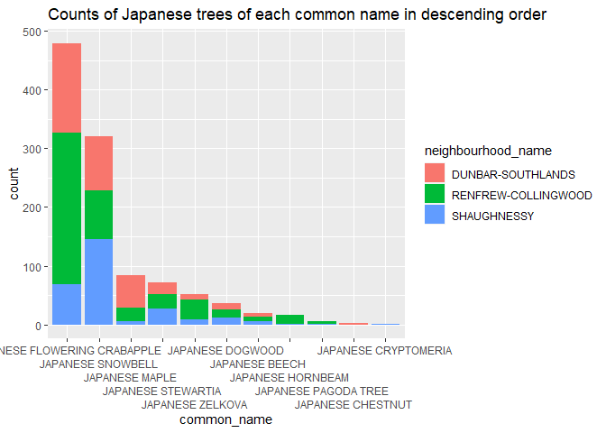
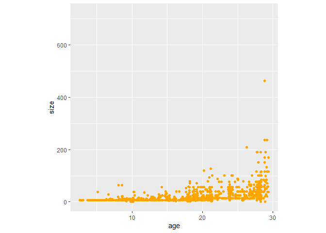

Mini Data-Analysis Deliverable 3
================

# Welcome to my last milestone in your mini data analysis project!

In this (3rd) milestone, we’ll be sharpening some of the results we
obtained from your previous milestone by:

-   Manipulating special data types in R: factors and/or dates and
    times.
-   Fitting a model object to your data, and extract a result.
-   Reading and writing data as separate files.

# Setup

Begin by loading data and the tidyverse package below:

``` r
suppressPackageStartupMessages(library(datateachr)) # <- might contain the data you picked!
suppressPackageStartupMessages(library(tidyverse))
suppressPackageStartupMessages(library(ggplot2))
suppressPackageStartupMessages(library(lubridate))
```

From Milestone 2, we chose two research questions:

1.  For all trees that have common names starting with “Japanese”, how
    are they spread across the city of Vancouver? Do they gather in
    groups by different species? Were they only planted in a small
    subarea of Vancouver?
2.  If investigating times of falling leaves for different tree species,
    how will it affect each areas of Vancouver with different color of
    trees, amount of tree shadow, etc?

And another thing to do before we start: we will use this refined
dataset below from milestone 2 that contains clean and necesary
variables and observations.

``` r
selected_common_name = c("JAPANESE SNOWBELL", "JAPANESE DOGWOOD", "JAPANESE ZELKOVA", "JAPANESE BEECH", "JAPANESE MAPLE", "JAPANESE FLOWERING CRABAPPLE", "JAPANESE STEWARTIA", "JAPANESE STEWARTIA", "JAPANESE HORNBEAM", "JAPANESE PAGODA TREE", "JAPANESE CRYPTOMERIA", "JAPANESE WALNUT", "JAPANESE ANGELICA TREE", "JAPANESE WHITE PINE", "JAPANESE BLACK PINE", "JAPANESE CHESTNUT")
refined_trees <- vancouver_trees %>%
  select(-civic_number, -assigned, -cultivar_name, -street_side_name, -longitude, -latitude) %>%
  mutate(vancouver_trees, size = height_range_id * pi * (diameter / 2)^2) %>%
  filter(size < 7.5*10^3, diameter < 40) %>%
  filter(common_name %in% selected_common_name) %>%
  mutate(fall_foliage = case_when(common_name == "JAPANESE SNOWBELL" ~ "red",
                                  common_name == "JAPANESE ZELKOVA" ~ "red",
                                  common_name == "JAPANESE MAPLE" ~ "brown",
                                  common_name == "JAPANESE FLOWERING CRABAPPLE" ~ "yellow",
                                  common_name == "JAPANESE STEWARTIA" ~ "red",
                                  common_name == "JAPANESE HORNBEAM" ~ "yellow",
                                  common_name == "JAPANESE PAGODA TREE" ~ "yellow",
                                  common_name == "JAPANESE CRYPTOMERIA" ~ "brown",
                                  common_name == "JAPANESE WALNUT" ~ "yellow",
                                  common_name == "JAPANESE ANGELICA TREE" ~ "brown",
                                  common_name == "JAPANESE WHITE PINE" ~ "green",
                                  common_name == "JAPANESE BLACK PINE" ~ "green",
                                  common_name == "JAPANESE CHESTNUT" ~ "red",
                                 TRUE ~ "NA")) %>%
  arrange(tree_id)
refined_trees$common_name <- factor(refined_trees$common_name)
print(refined_trees)
```

    ## # A tibble: 4,611 x 22
    ##    tree_id std_street genus_name species_name common_name           root_barrier
    ##      <dbl> <chr>      <chr>      <chr>        <fct>                 <chr>       
    ##  1     464 E 1ST AV   MALUS      FLORIBUNDA   JAPANESE FLOWERING C~ N           
    ##  2     465 E 1ST AV   MALUS      FLORIBUNDA   JAPANESE FLOWERING C~ N           
    ##  3     470 E 1ST AV   MALUS      FLORIBUNDA   JAPANESE FLOWERING C~ N           
    ##  4     472 E 1ST AV   MALUS      FLORIBUNDA   JAPANESE FLOWERING C~ N           
    ##  5     473 E 1ST AV   MALUS      FLORIBUNDA   JAPANESE FLOWERING C~ N           
    ##  6     474 E 1ST AV   MALUS      FLORIBUNDA   JAPANESE FLOWERING C~ N           
    ##  7     475 E 1ST AV   MALUS      FLORIBUNDA   JAPANESE FLOWERING C~ N           
    ##  8     476 E 1ST AV   MALUS      FLORIBUNDA   JAPANESE FLOWERING C~ N           
    ##  9     477 E 1ST AV   MALUS      FLORIBUNDA   JAPANESE FLOWERING C~ N           
    ## 10     478 E 1ST AV   MALUS      FLORIBUNDA   JAPANESE FLOWERING C~ N           
    ## # ... with 4,601 more rows, and 16 more variables: plant_area <chr>,
    ## #   on_street_block <dbl>, on_street <chr>, neighbourhood_name <chr>,
    ## #   height_range_id <dbl>, diameter <dbl>, curb <chr>, date_planted <date>,
    ## #   civic_number <dbl>, cultivar_name <chr>, assigned <chr>,
    ## #   street_side_name <chr>, longitude <dbl>, latitude <dbl>, size <dbl>,
    ## #   fall_foliage <chr>

# Exercise 1: Special Data Types (10)

For this exercise, we’ll be choosing two of the three tasks below:

1.  Produce a new plot that reorders a factor in your original plot,
    using the `forcats` package

2.  Produce a new plot that groups some factor levels together into an
    “other” category (or something similar), using the `forcats` package

3.  If your data has some sort of time-based column like a date (but
    something more granular than just a year):

    1.  Make a new column that uses a function from the `lubridate` or
        `tsibble` package to modify your original time-based column.
    2.  Then, in a sentence or two, explain how your new column might be
        useful in exploring a research question.

*Task 1 (for research question 1):*

``` r
# Summarize counts of trees per species for each neighborhood
answer1.1 <- refined_trees %>%
  filter(neighbourhood_name %in% c("DUNBAR-SOUTHLANDS", "SHAUGHNESSY", "RENFREW-COLLINGWOOD") )  %>%
#  group_by(neighbourhood_name) %>%
# Reorder the common name factor based on a descending count of observations
  mutate(common_name  = fct_infreq(common_name))
attributes(answer1.1$common_name)
```

    ## $levels
    ##  [1] "JAPANESE FLOWERING CRABAPPLE" "JAPANESE SNOWBELL"           
    ##  [3] "JAPANESE MAPLE"               "JAPANESE STEWARTIA"          
    ##  [5] "JAPANESE ZELKOVA"             "JAPANESE DOGWOOD"            
    ##  [7] "JAPANESE BEECH"               "JAPANESE HORNBEAM"           
    ##  [9] "JAPANESE PAGODA TREE"         "JAPANESE CHESTNUT"           
    ## [11] "JAPANESE CRYPTOMERIA"         "JAPANESE ANGELICA TREE"      
    ## [13] "JAPANESE BLACK PINE"          "JAPANESE WALNUT"             
    ## [15] "JAPANESE WHITE PINE"         
    ## 
    ## $class
    ## [1] "factor"

``` r
print(answer1.1)
```

    ## # A tibble: 1,088 x 22
    ##    tree_id std_street       genus_name species_name   common_name   root_barrier
    ##      <dbl> <chr>            <chr>      <chr>          <fct>         <chr>       
    ##  1     716 W KING EDWARD AV STYRAX     JAPONICA       JAPANESE SNO~ N           
    ##  2    7353 W 43RD AV        CORNUS     KOUSA          JAPANESE DOG~ N           
    ##  3   14378 E 14TH AV        CORNUS     KOUSA          JAPANESE DOG~ N           
    ##  4   17095 E 16TH AV        CORNUS     KOUSA          JAPANESE DOG~ N           
    ##  5   18367 SCHOOL AV        STEWARTIA  PSEUDOCAMELLIA JAPANESE STE~ N           
    ##  6   18377 SCHOOL AV        STEWARTIA  PSEUDOCAMELLIA JAPANESE STE~ N           
    ##  7   18488 W 17TH AV        CORNUS     KOUSA          JAPANESE DOG~ N           
    ##  8   19027 NOOTKA ST        MALUS      FLORIBUNDA     JAPANESE FLO~ N           
    ##  9   19028 NOOTKA ST        MALUS      FLORIBUNDA     JAPANESE FLO~ N           
    ## 10   19122 CARNARVON ST     STYRAX     JAPONICA       JAPANESE SNO~ N           
    ## # ... with 1,078 more rows, and 16 more variables: plant_area <chr>,
    ## #   on_street_block <dbl>, on_street <chr>, neighbourhood_name <chr>,
    ## #   height_range_id <dbl>, diameter <dbl>, curb <chr>, date_planted <date>,
    ## #   civic_number <dbl>, cultivar_name <chr>, assigned <chr>,
    ## #   street_side_name <chr>, longitude <dbl>, latitude <dbl>, size <dbl>,
    ## #   fall_foliage <chr>

``` r
ggplot(answer1.1, aes(x = common_name)) + geom_bar(aes(fill = neighbourhood_name)) + scale_x_discrete(guide = guide_axis(n.dodge=5)) + labs(title="Counts of Japanese trees of each common name in descending order")
```

<!-- -->

Here, re-ordering the factor of “common_name” is essential for our
understanding, since after re-ordering we can easily observe the common
trends of descending counts shared among all neighborhood. Thus we can
conclude that the first two tree species are most common for each
neighborhood, and the spread of other species are of very similar
patterns as well!

*Task 2 (for research question 1)*

``` r
#month(refined_trees$date_planted)
answer1.2 <- refined_trees %>%
  mutate(year = year(refined_trees$date_planted))
print(answer1.2)
```

    ## # A tibble: 4,611 x 23
    ##    tree_id std_street genus_name species_name common_name           root_barrier
    ##      <dbl> <chr>      <chr>      <chr>        <fct>                 <chr>       
    ##  1     464 E 1ST AV   MALUS      FLORIBUNDA   JAPANESE FLOWERING C~ N           
    ##  2     465 E 1ST AV   MALUS      FLORIBUNDA   JAPANESE FLOWERING C~ N           
    ##  3     470 E 1ST AV   MALUS      FLORIBUNDA   JAPANESE FLOWERING C~ N           
    ##  4     472 E 1ST AV   MALUS      FLORIBUNDA   JAPANESE FLOWERING C~ N           
    ##  5     473 E 1ST AV   MALUS      FLORIBUNDA   JAPANESE FLOWERING C~ N           
    ##  6     474 E 1ST AV   MALUS      FLORIBUNDA   JAPANESE FLOWERING C~ N           
    ##  7     475 E 1ST AV   MALUS      FLORIBUNDA   JAPANESE FLOWERING C~ N           
    ##  8     476 E 1ST AV   MALUS      FLORIBUNDA   JAPANESE FLOWERING C~ N           
    ##  9     477 E 1ST AV   MALUS      FLORIBUNDA   JAPANESE FLOWERING C~ N           
    ## 10     478 E 1ST AV   MALUS      FLORIBUNDA   JAPANESE FLOWERING C~ N           
    ## # ... with 4,601 more rows, and 17 more variables: plant_area <chr>,
    ## #   on_street_block <dbl>, on_street <chr>, neighbourhood_name <chr>,
    ## #   height_range_id <dbl>, diameter <dbl>, curb <chr>, date_planted <date>,
    ## #   civic_number <dbl>, cultivar_name <chr>, assigned <chr>,
    ## #   street_side_name <chr>, longitude <dbl>, latitude <dbl>, size <dbl>,
    ## #   fall_foliage <chr>, year <dbl>

If we would like to investigate the spread of Japanese trees across
Vancouver in terms of their ages, we would be interested in only the
year they were planted. Thus the new column containing only the year
planted would be useful and tidy.

# Exercise 2: Modelling

## 2.0 (no points)

**Research Question**: If investigating times of falling leaves for
different tree species, how will it affect each areas of Vancouver with
different color of trees, amount of tree shadow, etc?

**Variable of interest**: Y = size, of the particular tree species
“JAPANESE SNOWBELL”.

And by fitting the tree size and its age into a linear model, we expect
to find the tree size increases as age gets bigger. We will then know
the speed JAPANESE SNOWBELL grows as years go by, which helps us
determine the amount of falling leaves this species will produce each
year and in the future. If we would repeat this process for other tree
species, we would obtain different growing speed and corresponding
falling leaves amount, from which we can better answer the question!

## 2.1 (5 points)

``` r
answer1.2 <- answer1.2 %>%
  filter(common_name == "JAPANESE SNOWBELL") %>%
  mutate(age = 2021 - year)
answer2.1 <-  lm(size ~ age, answer1.2)
print(answer2.1)
```

    ## 
    ## Call:
    ## lm(formula = size ~ age, data = answer1.2)
    ## 
    ## Coefficients:
    ## (Intercept)          age  
    ##     -11.190        1.976

``` r
ggplot(answer1.2, aes(x = age, y = size)) + geom_jitter(color = "orange") + theme(aspect.ratio=1)
```

    ## Warning: Removed 228 rows containing missing values (geom_point).

<!-- -->

And here is a plot just for fun: we observe an expected trend of
increasing size as trees age increases.

## 2.2 (5 points)

We now produce the regression co-efficents of our linear model:

``` r
print(answer2.1)
```

    ## 
    ## Call:
    ## lm(formula = size ~ age, data = answer1.2)
    ## 
    ## Coefficients:
    ## (Intercept)          age  
    ##     -11.190        1.976

One valuable parameter we obtained from the linear model is the
regression coefficients: 1.976 (observed from the printed results). We
thus obtained the speed that “JAPANESE SNOWBELL” is growing across
Vancouver(it grows 1.976 size units per year on average).

# Exercise 3: Reading and writing data

## 3.1 (5 points)

We now take a summary table from Milestone 2 (Exercise 1.2), and write
it as a csv file in my `output` folder. Use the `here::here()` function.

Let’s remake our summarized foliage count table from milestone 2:

``` r
Japanese_trees <- vancouver_trees %>%
  select(-civic_number, -assigned, -cultivar_name, -street_side_name, -longitude, -latitude) %>%
  #filter(size < 7.5*10^3, diameter < 40) %>%
  filter(common_name %in% selected_common_name)
summarized <- Japanese_trees %>%
  mutate(fall_foliage = case_when(common_name == "JAPANESE SNOWBELL" ~ "red",
                                  common_name == "JAPANESE ZELKOVA" ~ "red",
                                  common_name == "JAPANESE MAPLE" ~ "brown",
                                  common_name == "JAPANESE FLOWERING CRABAPPLE" ~ "yellow",
                                  common_name == "JAPANESE STEWARTIA" ~ "red",
                                  common_name == "JAPANESE HORNBEAM" ~ "yellow",
                                  common_name == "JAPANESE PAGODA TREE" ~ "yellow",
                                  common_name == "JAPANESE CRYPTOMERIA" ~ "brown",
                                  common_name == "JAPANESE WALNUT" ~ "yellow",
                                  common_name == "JAPANESE ANGELICA TREE" ~ "brown",
                                  common_name == "JAPANESE WHITE PINE" ~ "green",
                                  common_name == "JAPANESE BLACK PINE" ~ "green",
                                  common_name == "JAPANESE CHESTNUT" ~ "red",
                                 TRUE ~ "NA")) %>%
  select(tree_id, common_name, neighbourhood_name, fall_foliage, height_range_id) %>%
  filter(fall_foliage != "NA") %>%
  group_by(neighbourhood_name, fall_foliage) %>%
  summarise(count = n())
```

    ## `summarise()` has grouped output by 'neighbourhood_name'. You can override using the `.groups` argument.

``` r
print(summarized)
```

    ## # A tibble: 67 x 3
    ## # Groups:   neighbourhood_name [22]
    ##    neighbourhood_name fall_foliage count
    ##    <chr>              <chr>        <int>
    ##  1 ARBUTUS-RIDGE      brown           26
    ##  2 ARBUTUS-RIDGE      red             21
    ##  3 ARBUTUS-RIDGE      yellow          86
    ##  4 DOWNTOWN           brown            1
    ##  5 DOWNTOWN           red             26
    ##  6 DOWNTOWN           yellow          23
    ##  7 DUNBAR-SOUTHLANDS  brown           55
    ##  8 DUNBAR-SOUTHLANDS  red            121
    ##  9 DUNBAR-SOUTHLANDS  yellow         154
    ## 10 FAIRVIEW           brown           15
    ## # ... with 57 more rows

``` r
here::here()
```

    ## [1] "C:/Users/Christina Sun/OneDrive/Desktop/Christina_Mini_Data_Analysis"

``` r
# dir.create(here::here("output"))
write_csv(summarized, here::here("output", "exported_foliage_count.csv"))
```

## 3.2 (5 points)

Write our model object from Exercise 2 to an R binary file (an RDS), and
load it again. Be sure to save the binary file in our `output` folder.
Use the functions `saveRDS()` and `readRDS()`.

``` r
saveRDS(answer2.1, here::here("output", "binary_size_age_linear_model"))
model <- readRDS(here::here("output", "binary_size_age_linear_model"))
```

And here is our csv file and binary file that can be found in the output
folder inside of our mini project folder!

# Tidy Repository

Now that this is your last milestone, your entire project repository
should be organized. Here are the criteria we’re looking for.

## Main README (3 points)

There should be a file named `README.md` at the top level of your
repository. Its contents should automatically appear when you visit the
repository on GitHub.

Minimum contents of the README file:

-   In a sentence or two, explains what this repository is, so that
    future-you or someone else stumbling on your repository can be
    oriented to the repository.
-   In a sentence or two (or more??), briefly explains how to engage
    with the repository. You can assume the person reading knows the
    material from STAT 545A. Basically, if a visitor to your repository
    wants to explore your project, what should they know?

Once you get in the habit of making README files, and seeing more README
files in other projects, you’ll wonder how you ever got by without them!
They are tremendously helpful.

## File and Folder structure (3 points)

You should have at least four folders in the top level of your
repository: one for each milestone, and one output folder. If there are
any other folders, these are explained in the main README.

Each milestone document is contained in its respective folder, and
nowhere else.

Every level-1 folder (that is, the ones stored in the top level, like
“Milestone1” and “output”) has a `README` file, explaining in a sentence
or two what is in the folder, in plain language (it’s enough to say
something like “This folder contains the source for Milestone 1”).

## Output (2 points)

All output is recent and relevant:

-   All Rmd files have been `knit`ted to their output, and all data
    files saved from Exercise 3 above appear in the `output` folder.
-   All of these output files are up-to-date – that is, they haven’t
    fallen behind after the source (Rmd) files have been updated.
-   There should be no relic output files. For example, if you were
    knitting an Rmd to html, but then changed the output to be only a
    markdown file, then the html file is a relic and should be deleted.

Our recommendation: delete all output files, and re-knit each
milestone’s Rmd file, so that everything is up to date and relevant.

PS: there’s a way where you can run all project code using a single
command, instead of clicking “knit” three times. More on this in STAT
545B!

## Error-free code (1 point)

This Milestone 3 document knits error-free.

## Tagged release (1 point)

We’ve tagged a release for Milestone 3.
